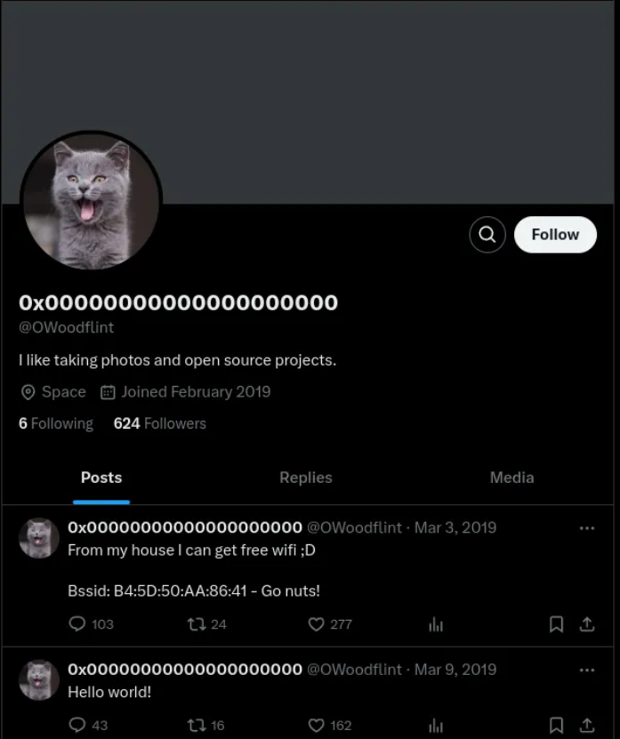
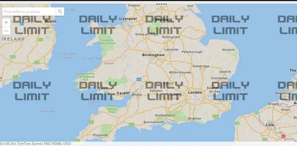
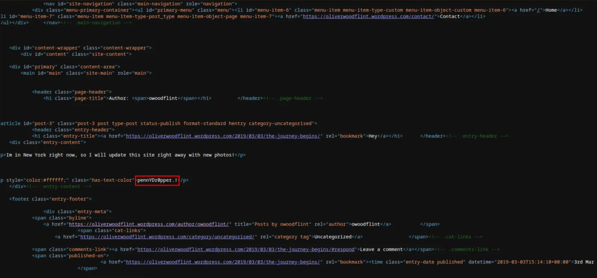

# OhSINT 

##  Overview

In this challenge, we’re tasked with performing **passive Open-Source Intelligence (OSINT)**—starting from a single image and following digital breadcrumbs to uncover deeper information about the subject. We rely solely on online tools, metadata, and sleuthing—not exploitation.

---

##  Step 1 – Image Metadata Research

- **Tool Used:** `exiftool` (or an online EXIF metadata viewer)
- Got copyright name : "OWoodflint"
- After google search of that handle we come accross a Twitter page with profile pictiure of ‘cat’, this immediatly gave me a clue to the question one answer, what is the avatar.
- 

## Step 2 
- Target have leaked their wifi BSSID on Twitter page from that inforamtion used https://wigle.net/ to search his BSSID.
- 

## Step 3
- From his blog site we see that he went to New York on holidays. The blog site is hosted is powered by Word Press.

## Step 4

- Can see that, he had leaked his password in Web source code.

# Answers got

- '1.cat' '2.London' '3.UnileverWifi' '4.OWoodflint@gmail.com' '5.Github' '6.NewYork' '7.pennYDr0pper.!'

# Conclusion 

- From just one image, we managed to uncover the user’s online presence, email, Wi-Fi details, travel history, and even a password. This challenge shows how powerful OSINT can be and why people need to be careful about the information they leave online.